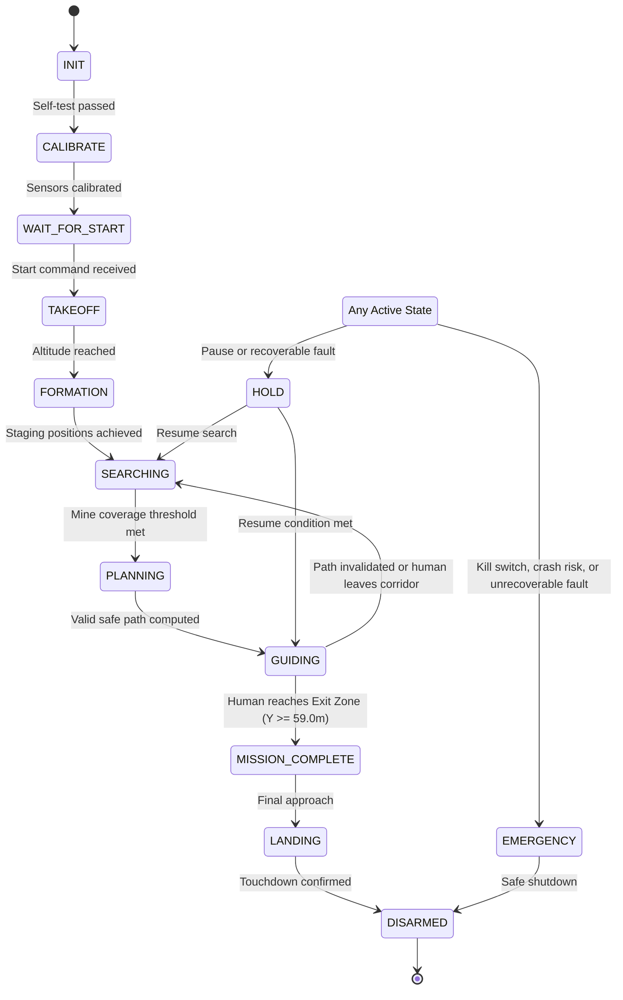

# System Requirements Specification: Robofest Gujarat 6.0 Minefield Swarm Drone

---

## 1. Requirement Classification Overview

To ensure strict compliance with competition mandates and modular embedded software design, all requirements are formally organized into three tiers:
1. **Official Requirements (`[OFFICIAL]`)**: Non-negotiable competition rules, arena boundaries, time limits, and regulatory constraints established by Robofest Gujarat 6.0 organizers.
2. **Derived Requirements (`[DERIVED]`)**: Engineering specifications, mathematical extensions, architectural separations, and logical deductions necessary to satisfy official constraints.
3. **Tunable Implementation Defaults (`[TUNABLE]`)**: Software configuration parameters, thresholds, and filter gains that may be adjusted during field calibration without modifying core logic.

---

## 2. Official Mission Constraints (`[OFFICIAL]`)

### 2.1 Swarm Composition & Fleet Sizing
- `REQ-OFF-001`: **Swarm Size**: A minimum of three (3) autonomous drones is strictly required to execute the mission.
- `REQ-OFF-002`: **Ideal Swarm Size**: The ideal swarm configuration is 3 to 4 drones.

### 2.2 Time Limit
- `REQ-OFF-003`: **Mission Duration Limit**: The maximum allowable mission time is 10 minutes (600.0 seconds / 600,000 milliseconds).
- `REQ-OFF-004`: **Mission Timeout Action**: When the 600,000 ms limit is reached, all active drones must immediately abort searching/guiding and initiate autonomous landing.

### 2.3 Field Dimensions & Arena Geometry
- `REQ-OFF-005`: **Total Field Size**: The operational field is 15.0 meters wide (X-axis in standard layout: 0.0 m to 15.0 m) by 60.0 meters long (Y-axis: 0.0 m to 60.0 m).
- `REQ-OFF-006`: **Start Zone**: Defined as a 1.0 m by 15.0 m corridor spanning Y: [0.0 m, 1.0 m], X: [0.0 m, 15.0 m].
- `REQ-OFF-007`: **Minefield Zone**: Defined as a 58.0 m by 15.0 m hazard sector spanning Y: [1.0 m, 59.0 m], X: [0.0 m, 15.0 m].
- `REQ-OFF-008`: **Exit Zone**: Defined as a 1.0 m by 15.0 m safe arrival corridor spanning Y: [59.0 m, 60.0 m], X: [0.0 m, 15.0 m].

### 2.4 Mine Clearance & Safe Path Geometry
- `REQ-OFF-009`: **Minimum Mine Clearance**: Any planned or guided path for the human-at-risk must maintain a strict clearance of at least 1.0 meter (radial distance) from the center of every confirmed mine.

### 2.5 Positioning & Communication Restrictions
- `REQ-OFF-010`: **No GPS / GNSS**: Drones must not utilize Global Positioning System (GPS), GNSS, or satellite-based positioning.
- `REQ-OFF-011`: **No External Positioning**: Drones must not utilize external positioning systems, motion-capture rigs (e.g., OptiTrack, Vicon), or active base-station transponders.
- `REQ-OFF-012`: **No Cloud or External Infrastructure**: Drones must not communicate with cloud servers, offboard computers, base stations, or ground control telemetry links.
- `REQ-OFF-013`: **No Remote Pilot Control**: Manual RC flight or operator intervention is prohibited during autonomous mission execution. All decisions must be made strictly onboard.

### 2.6 Core Mission Capabilities
- `REQ-OFF-014`: **Onboard Mine Detection**: Drones must visually detect surface-laid mines and buried-mine surface markers.
- `REQ-OFF-015`: **Onboard Mine Mapping & Deduplication**: Drones must map detected mines in a unified coordinate frame and prevent duplicate registrations from overlapping drone observations.
- `REQ-OFF-016`: **Safe Path Generation**: Drones must autonomously compute an obstacle-free corridor from Start Zone to Exit Zone.
- `REQ-OFF-017`: **Visual Path Guidance**: Drones must visually project or mark the safe route to guide the person-at-risk.
- `REQ-OFF-018`: **Human Command Understanding**: Drones must recognize and respond to human gestural (hand) or acoustic (voice) commands.
- `REQ-OFF-019`: **Human Tracking & Re-routing**: Drones must track the human's real-time position. If the human leaves the safe corridor or if a newly discovered mine obstructs the route, the swarm must dynamically compute and project a revised safe path.
- `REQ-OFF-020`: **Autonomous Termination & Landing**: Drones must land autonomously when the mission ends or upon irrecoverable fault.
- `REQ-OFF-021`: **Surface Contact Restriction**: Drones must avoid all unwanted surface contact. Controlled landing at the conclusion of the mission is the only permitted ground contact.
- `REQ-OFF-022`: **Collision & Proximity Avoidance**: Drones must avoid collisions with other swarm members, obstacles, and the person-at-risk.

---

## 3. Derived Engineering Requirements (`[DERIVED]`)

### 3.1 Expected Minefield Characteristics
- `REQ-DER-001`: **Expected Mine Count**: The system is configured for approximately 40 active mines distributed across the 58 m x 15 m minefield zone.
- `REQ-DER-002`: **Mine Type Distribution**: Approximately 75% of mines are visible on-ground objects; approximately 25% are buried mines (30 mm to 50 mm burial depth) tagged with standardized surface markers.
- `REQ-DER-003`: **Obstacle Avoidance**: The software architecture includes support for stationary obstacles (e.g., boundary poles, vertical stanchions, or trees) embedded into the navigation costmap.

### 3.2 System Architecture & Control Hierarchy
- `REQ-DER-004`: **Separation of Concerns**: The mission computer (ESP32-S3) manages high-level logic, trajectory generation, and safety supervision. It transmits high-level commands (`HOLD`, `TAKEOFF`, `LAND`, `VELOCITY`, `ALTITUDE`, `HEADING`, `ARM`, `DISARM`, `EMERGENCY_STOP`) to the flight controller over high-speed serial (UART).
- `REQ-DER-005`: **Low-Level Flight Handling**: Low-level motor mixing, attitude estimation, rate PID loops, and hardware motor cutoffs are delegated entirely to the flight controller.
- `REQ-DER-006`: **Deterministic Execution Frequency**: The main task scheduler runs non-blocking cycles at 50 Hz (20 ms period).

### 3.3 Safety & Failsafe Management
- `REQ-DER-007`: **Kill Switch Monitoring**: The software continuously polls a digital kill switch input (`KILL_SWITCH_PIN`). Physical wiring must also allow independent hardware power disconnection.
- `REQ-DER-008`: **Battery Failsafe Thresholds**:
  - *Low Battery* (14.0 V): Prepares for landing, alerts peer drones to assume role, and begins retreat to safe landing area.
  - *Critical Battery* (13.6 V): Forces immediate controlled landing.
- `REQ-DER-009`: **Flight Controller Heartbeat Watchdog**: Loss of FC telemetry communication for > 500 ms triggers an immediate `HOLD` command; sustained loss > 2000 ms triggers autonomous `LAND`.
- `REQ-DER-010`: **Localization Degradation Watchdog**: Loss of optical flow / ToF height data triggers `HOLD` mode for recovery; if unrecovered within 3000 ms, triggers emergency controlled `LAND`.
- `REQ-DER-011`: **Inter-Drone Collision Prevention**: Swarm drones broadcast position vectors over P2P RF and maintain minimum lateral separation of 1.0 m to 2.0 m.

---

## 4. Drone Roles (`[DERIVED]`)

The swarm assigns drones into dedicated operational roles:

| Role | Identifier | Primary Responsibilities |
| :--- | :--- | :--- |
| **SCOUT_LEFT** | `SCOUT_LEFT` | Sweeps the left lateral sector ($X \in [0.0, 7.5]\text{ m}$) for surface and buried mines; broadcasts mine coordinates. |
| **SCOUT_RIGHT** | `SCOUT_RIGHT` | Sweeps the right lateral sector ($X \in [7.5, 15.0]\text{ m}$) for surface and buried mines; broadcasts mine coordinates. |
| **GUIDE_MARKER** | `GUIDE_MARKER` | Hovers ahead of the person-at-risk, projects visual path markers, monitors human gestures, and tracks path adherence. |
| **RESERVE** | `RESERVE` | Acts as a standby scout/marker unit, ready to replace any drone experiencing low battery, sensor degradation, or communication dropout. |

---

## 5. Mission State Machine Specification

### 5.1 Complete State List
1. `INIT`: Hardware power-on, self-test, peripheral initialization, and memory allocation.
2. `CALIBRATE`: Optical flow zeroing, ToF ground offset measurement, and IMU bias calibration.
3. `WAIT_FOR_START`: Drone armed on ground at Start Zone; waiting for synchronization broadcast or start command.
4. `TAKEOFF`: Autonomous vertical ascent to operational survey altitude (`MISSION_ALTITUDE_M = 2.0f`).
5. `FORMATION`: Drones navigate to initial search staging positions along Start Zone boundary.
6. `SEARCHING`: Systematic lawnmower or coordinated sweep over the minefield to discover and map mines.
7. `PLANNING`: Path planning algorithm evaluates accumulated mine map and computes optimal safe corridor ($\ge 1.0\text{ m}$ clearance).
8. `GUIDING`: Active visual escort mode; drone projects path and monitors human progress through the corridor.
9. `MISSION_COMPLETE`: Human successfully steps inside the Exit Zone ($Y \ge 59.0\text{ m}$).
10. `LANDING`: Autonomous descent to surface at controlled step rates (`LANDING_ALTITUDE_STEP_M = 0.2f`).
11. `DISARMED`: Motors stopped, flight controller disarmed, mission log finalized.
12. `HOLD`: Temporary station-keeping in place due to recoverable sensor hiccup, human hesitation, or dynamic replanning.
13. `EMERGENCY`: Immediate failsafe execution (motor cutoff or rapid emergency landing) due to hardware fault, boundary breach, or kill switch activation.

### 5.2 State Transition Logic



```text
INIT -> CALIBRATE -> WAIT_FOR_START -> TAKEOFF -> FORMATION -> SEARCHING
SEARCHING -> PLANNING when enough mine coverage exists
PLANNING -> GUIDING when a valid safe path exists
GUIDING -> SEARCHING if path is invalidated or human leaves corridor
GUIDING -> MISSION_COMPLETE when human reaches Exit Zone
MISSION_COMPLETE -> LANDING
ANY_STATE -> HOLD for pause or recoverable fault
ANY_STATE -> EMERGENCY for kill switch, crash risk, or unrecoverable fault
LANDING -> DISARMED
```

---

## 6. Communication, Commands, Safety Actions, and Visual Patterns

### 6.1 Expected Swarm Packet Types
- `HEARTBEAT`: Periodic status, state, role, battery, and pose broadcast.
- `ROLE_ASSIGN`: Leader negotiation or dynamic role reassignment packet.
- `CLAIM`: Claim ownership of a search cell or sector to prevent duplicate sweeps.
- `YIELD`: Relinquish ownership of a sector due to low battery or sensor fault.
- `MINE_UPDATE`: Broadcast newly discovered mine position, type, and confidence.
- `PATH_UPDATE`: Disseminate newly computed global safe path.
- `PERSON_UPDATE`: Broadcast tracked human coordinates, speed, and status.
- `HELP_REQUEST`: Signal peer assistance needed for scan completion or escort duty.
- `LAND_NOW`: Swarm-wide synchronized landing command.

### 6.2 Human Command Types
- `NONE`: No command recognized / idle.
- `START`: Initiate autonomous mission execution from Start Zone.
- `FORWARD`: Acknowledge safe path and signal guide drone to advance.
- `PAUSE`: Temporarily hold guide drone and signal human to halt.
- `SCAN_LEFT`: Instruct guide/scout to verify left margin of corridor.
- `SCAN_RIGHT`: Instruct guide/scout to verify right margin of corridor.
- `STOP_ABORT`: Immediate emergency abort / halt human movement.

### 6.3 Safety Actions
- `CONTINUE`: Safe flight parameters verified; proceed with current task.
- `HOLD`: Halt velocity setpoint, maintain altitude and hover in place.
- `LAND`: Initiate controlled step descent to ground level.
- `EMERGENCY_CUT`: Immediate motor disarm / cutoff in critical unrecoverable failure.

### 6.4 Marker Patterns (Visual Guidance)
- `MARKER_OFF`: Visual projectors/lasers disabled.
- `MARKER_FORWARD`: Project forward directional arrow/corridor along path.
- `MARKER_STOP`: Project bright stop boundary / red halt bar in front of human.
- `MARKER_LEFT`: Project directional correction toward left safe boundary.
- `MARKER_RIGHT`: Project directional correction toward right safe boundary.
- `MARKER_SAFE_PATH`: Continuous green/high-contrast safe corridor projection.
- `MARKER_EMERGENCY`: Rapid flashing warning pattern across entire hazard radius.
- `MARKER_MISSION_COMPLETE`: Arrival indicator projected within Exit Zone.

---

## 7. Tunable Implementation Defaults (`[TUNABLE]`)

| Parameter | Default Value | Unit | Description |
| :--- | :--- | :--- | :--- |
| `MISSION_ALTITUDE_M` | `2.0` | meters | Operational survey altitude |
| `LANDING_ALTITUDE_STEP_M` | `0.2` | meters | Step descent rate per cycle |
| `OPTICAL_FLOW_FOCAL_LENGTH_PX`| `400.0` | px | Optical flow camera focal length |
| `TOF_ALTITUDE_FILTER_ALPHA` | `0.85` | - | Exponential moving average alpha for ToF altitude |
| `FLOW_QUALITY_MIN` | `0.30` | - | Minimum optical flow quality factor required |
| `DRIFT_UNCERTAINTY_LIMIT_M` | `1.0` | meters | Maximum allowed dead-reckoning drift estimate |
| `IMAGE_WIDTH` / `HEIGHT` | `320 x 240` | px | Downward vision sensor resolution |
| `H_FOV_DEG` / `V_FOV_DEG` | `60.0 / 45.0` | deg | Camera field of view angles |
| `CIRCULARITY_MIN` | `0.70` | - | Minimum circularity score for surface mine blob |
| `BLOB_AREA_MIN_PX` / `MAX_PX`| `25.0 / 2500.0` | px | Blob size filter range |
| `CONFIDENCE_REPORT_MIN` | `45.0` | % | Minimum detection confidence to emit candidate |
| `PERSISTENCE_RADIUS_M` | `0.25` | meters | Clustering radius for persistence tracking |
| `PERSISTENCE_COUNT_MIN` | `5` | frames | Minimum frame occurrences to promote candidate |
| `SAME_DRONE_DEDUP_RADIUS_M` | `0.30` | meters | Intra-drone mine clustering radius |
| `CROSS_DRONE_DEDUP_RADIUS_M`| `0.50` | meters | Inter-drone mine clustering radius |
| `MINE_CONFIRM_CONFIDENCE_MIN`| `70.0` | % | Confidence threshold to mark mine as CONFIRMED |
| `MINE_STALE_TIMEOUT_MS` | `15000` | ms | Candidate timeout before eviction |
| `PATH_GRID_RESOLUTION_M` | `0.5` | meters | A* navigation grid cell resolution |
| `OBSTACLE_INFLATION_RADIUS_M`| `0.5` | meters | Costmap obstacle dilation margin |
| `HUMAN_CORRIDOR_WIDTH_M` | `1.0` | meters | Safe walking path corridor width |
| `PATH_EXACT_CLEARANCE_STEP_M`| `0.25` | meters | Raycast clearance verification step |
| `PATH_SMOOTHING_DISTANCE_M` | `0.75` | meters | Lookahead distance for path smoothing |
| `COMMAND_DEBOUNCE_MS` | `300` | ms | Gesture/voice input debounce filter |
| `COMMAND_LOCKOUT_MS` | `1500` | ms | Lockout period after executing command |
| `COMMAND_HYSTERESIS_FRAMES` | `3` | frames | Frame voting depth for command recognition |
| `HUMAN_TRACK_CONFIDENCE_MIN` | `0.60` | - | Minimum human detection confidence |
| `HUMAN_OFF_PATH_DISTANCE_M` | `0.75` | meters | Distance deviation threshold triggering re-route |
| `HUMAN_RECOVERY_TIMEOUT_MS` | `3000` | ms | Time before degraded tracking triggers HOLD |
| `HUMAN_EXIT_CONFIRM_TIMEOUT_MS`| `2000`| ms | Dwell time in Exit Zone to declare mission complete |
